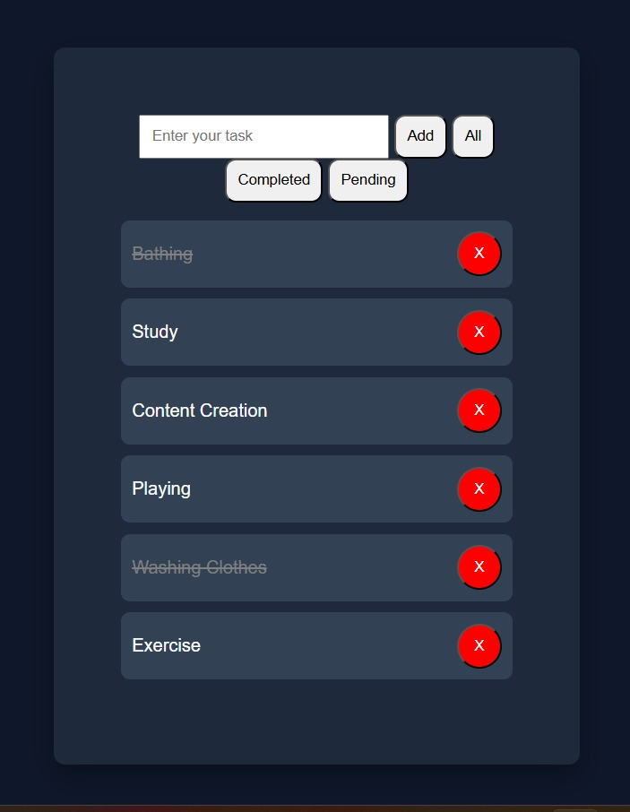

# Advanced Todo App

A fully functional Todo application built using HTML, CSS, and JavaScript.

## Features

* Add, Delete, Toggle and Edit tasks.
* Mark tasks as Completed.
* Filter tasks (All / Completed / Pending).
* Data stored using LocalStorage.
* Clean and responsive UI.

## Tech Stack

* HTML
* CSS
* JavaScript (DOM + LocalStorage)

## Live Demo

[To-Do-AppLive_Demo](https://github.com/subho8235-rizu/To-Do-App)

## 📸 Screenshot

